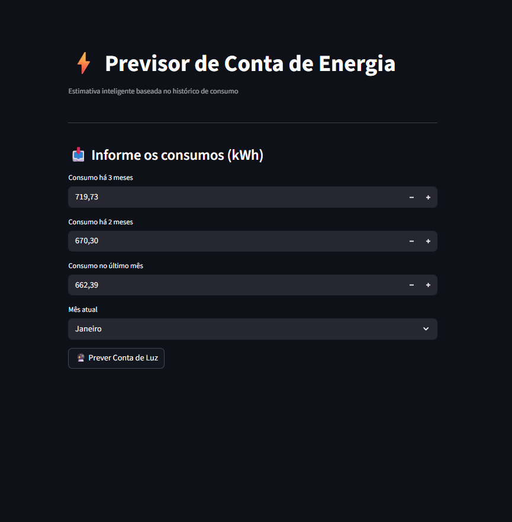
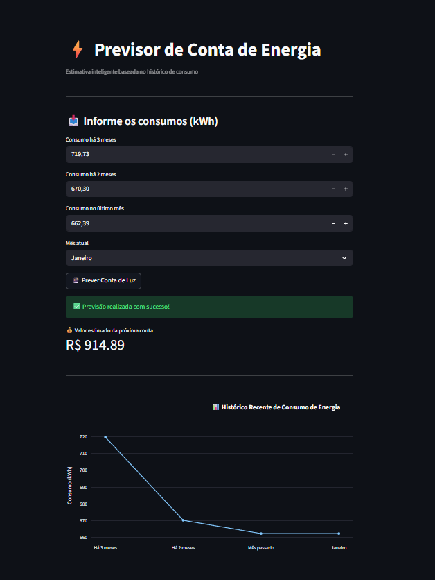

# ⚡ Previsor de Conta de Energia — Equatorial PA

Projeto completo de **Machine Learning + API + Dashboard** para previsão do valor da conta de energia elétrica com base no consumo recente.

Projeto desenvolvido como portfólio de Data Science / Machine Learning.
<p align="center">


</p>
---

# 🎯 Problema de negócio

Muitas pessoas não conseguem prever o valor da conta de energia antes da fatura chegar.  
Isso dificulta:

- planejamento financeiro
- controle de gastos domésticos
- identificação de aumentos inesperados

Este projeto usa **Machine Learning** para estimar o valor da próxima fatura com base no histórico de consumo.

---

# 🧠 Machine Learning

## 📊 Dataset

Dataset com histórico mensal contendo:

- mês
- consumo (kWh)
- valor da conta (R$)

Como a base era pequena, aplicamos **Data Augmentation** para simular novos dados realistas.

---

## 🔁 Data Augmentation

Algoritmo criado para aumentar o dataset adicionando ruído controlado:

| Variável | Ruído aplicado |
|---|---|
| Consumo | ±8% |
| Valor da conta | ±5% |

Simula variações reais:
- clima
- bandeiras tarifárias
- hábitos de consumo

Resultado: dataset aumentado ~30x.

---

## 🧮 Engenharia de Features

Criamos variáveis que representam comportamento real:

| Feature | Descrição |
|---|---|
| `consumo_anterior` | consumo do mês mais recente |
| `media_3_messes` | média dos últimos 3 meses |
| `mes_num` | mês do ano (sazonalidade) |

Essas features capturam:
- tendência
- comportamento recente
- sazonalidade anual

---

## ✂️ Divisão Treino/Teste

Dataset dividido em:

- 80% treino
- 20% teste

---

## 🤖 Modelo escolhido

### 🌲 Random Forest Regressor

Motivos:
- Captura relações não lineares
- Robusto a ruído
- Excelente para datasets pequenos

---

## 🔎 Otimização com GridSearchCV

Hiperparâmetros otimizados:

- `n_estimators`
- `max_depth`
- `min_samples_leaf`
- `min_samples_split`

---

## 📈 Resultados finais

| Métrica | Resultado |
|---|---|
| MAE | **R$ 37,78** |
| RMSE | **R$ 49,90** |
| R² | **0.808** |

### Interpretação

O modelo explica **80,8% da variação** da conta de energia.

Erro médio ≈ R$38 → ótimo para previsão doméstica.

---

# 💾 Exportação do modelo

```python
joblib.dump(modelo, "modelo_conta_luz.joblib")
